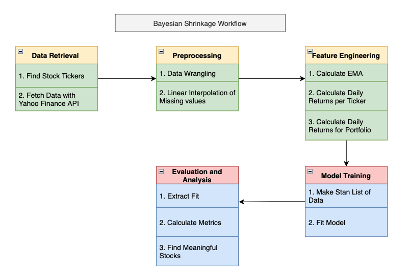
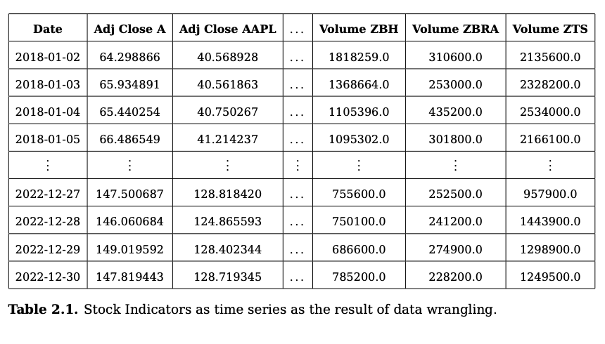
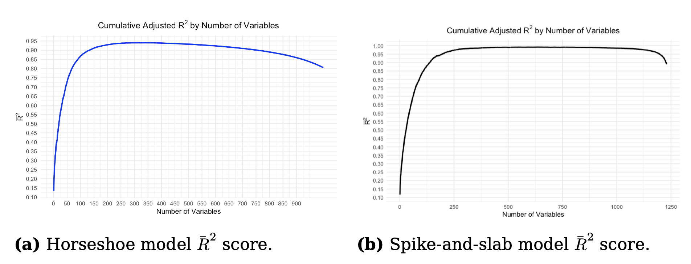
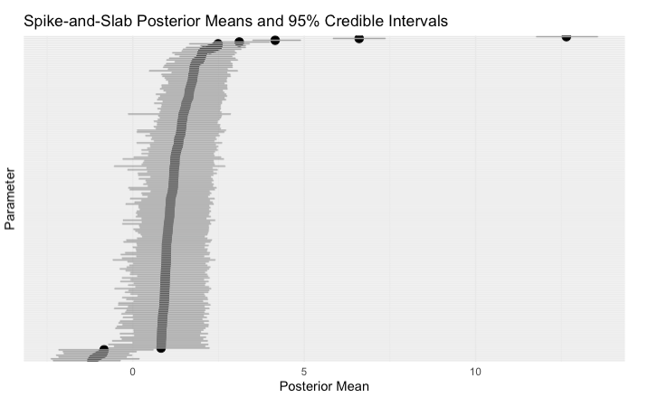

# Bayesian Regression Toolkit for High-Dimensional Financial Data

## Overview

This repository provides a study about Bayesian regression on high-dimensional financial time series, with a focus on the S&P 500. It implements models with **shrinkage priors**—including **horseshoe** and **spike-and-slab**—to handle high-dimensionality, discover sparsity, and generate interpretable predictions.



## Features

- Identify the most influential stocks in S&P 500 portfolios.
- Apply Bayesian regression with **horseshoe** and **spike-and-slab** priors.
- Handle high-dimensional datasets efficiently using shrinkage techniques.
- Generate interpretable model outputs and posterior summaries.
- Visualize results for decision-making and portfolio analysis.

## Workflow

### 1. Data Preparation
- Input: Daily S&P 500 data from **2018–2023**.
- Features include adjusted close prices, daily returns, moving averages, and technical indicators.
- Preprocessing steps:
  - Normalize features:
    ```
    Normalized Feature = (x - μ) / σ
    ```
  - Compute daily returns:
    ```
    DR_t = (AC_t - AC_{t-1}) / AC_{t-1}
    ```



### 2. Model Setup

#### Horseshoe Prior
```stan
parameters {
  real alpha;
  vector[P] beta;
  real<lower=0> sigma;
  real<lower=0> tau;
  vector<lower=0>[P] lambda;
  real<lower=0> c;
}

transformed parameters {
  vector[P] beta_shrunk;
  beta_shrunk = beta .* (tau * lambda);
}

model {
  alpha ~ normal(0, 5);
  lambda ~ cauchy(0, 1);
  tau ~ cauchy(0, 1);
  beta ~ normal(0, 1);
  sigma ~ normal(0, 1);
  y ~ normal(X * beta_shrunk + alpha, sigma);
}
```

### Spike-and-slab
```stan
parameters {
  real alpha;
  vector[P] beta;
  real<lower=0> sigma;
  real<lower=0> slab_scale;
  real<lower=0> spike_scale;
  vector<lower=0, upper=1>[P] theta;
}

transformed parameters {
  vector[P] beta_shrunk;
  beta_shrunk = beta .* (1 - theta) * spike_scale + beta .* theta * slab_scale;
}

model {
  alpha ~ normal(0, 5);
  spike_scale ~ normal(0, 0.1);
  slab_scale ~ normal(0, 1);
  theta ~ beta(1, 1);
  beta ~ normal(0, 1);
  sigma ~ normal(0, 1);
  y ~ normal(X * beta_shrunk + alpha, sigma);
}

generated quantities {
  vector[N] y_pred = X * beta_shrunk + alpha;
}
```


### Model training

```stan
# Compile the Stan model
stan_model_code <- readLines("horseshoe_model.stan")
stan_model <- stan_model(model_code = stan_model_code)

# Fit the model
fit <- sampling(
  stan_model,
  data = stan_data, 
  iter = 2000,
  chains = 4,
  warmup = 500,
  thin = 1,
  seed = 123,
  control = list(adapt_delta = 0.95, max_treedepth=15)
)
```

4. Results and Visualization
The result might look like something as follows:
    - predictive performance:


    - parameter estimates with credible intervals:



